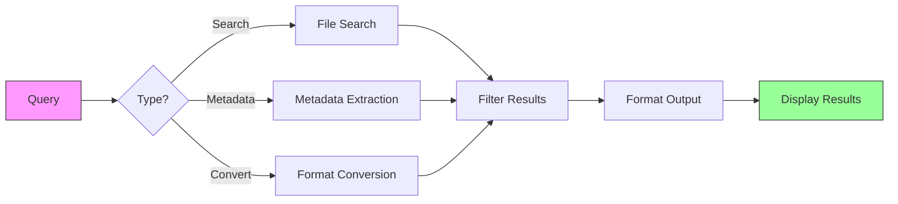

# qry

Ultra-fast file search and metadata extraction tool

## 🚀 Installation

Using Poetry (recommended):

```bash
# Install Poetry if you don't have it
curl -sSL https://install.python-poetry.org | python3 -


# Clone the repository and install dependencies
poetry install
```

Or using pip:

```bash
pip install -r requirements.txt
```

## 🚀 Quick Start

### Using Poetry:

```bash
# Search with default scope (current directory) and depth (unlimited)
poetry run qry "your search query"

# Custom scope and depth
poetry run qry "your search query" --scope /path/to/search --depth 3
```

### Direct Python execution:

```bash
# Basic search
python qry.py "your search query"

# With custom scope and depth
python qry.py "your search query" --scope /path/to/search --depth 2
```

## 🔧 Available Options

### CLI Options

```
Usage: qry [OPTIONS] COMMAND [ARGS]...

Options:
  --help  Show this message and exit.

Commands:
  search   Search for files
  version  Show version information
  help     Show help

Search Options:
  -t, --type TEXT      Filter by file type (comma-separated)
  -s, --scope TEXT     Search scope directory (default: current directory)
  -d, --depth INT      Maximum depth to search
  --last-days INT      Filter by last N days
  -l, --limit INT      Maximum number of results (default: 100)
  --no-preview         Disable preview generation
  -v, --verbose        Enable verbose output
```

### API Endpoints

- `GET /api/search` - Search for files
  - Parameters:
    - `q`: Search query (required)
    - `types`: Comma-separated list of file types
    - `limit`: Maximum number of results (default: 100)
    - `last_days`: Filter by last N days
    - `engine`: Search engine to use (default: 'default')

## 🛠️ Development

### Project Structure

- `qry/cli/` - Command-line interface
- `qry/api/` - REST API implementation
- `qry/core/` - Core models and interfaces
- `qry/engines/` - Search engine implementations
- `qry/utils/` - Utility functions
- `qry/web/` - Web interface components

### Adding a New Search Engine

1. Create a new file in `qry/engines/`
2. Implement the `SearchEngine` interface from `qry.engines.base`
3. Register your engine in `qry/engines/__init__.py`

### Running Tests

```bash
# Install test dependencies
pip install -e ".[test]"

# Run tests
pytest
```

## 🤝 Contributing

Contributions are welcome! Please feel free to submit a Pull Request.

1. Fork the repository
2. Create your feature branch (`git checkout -b feature/amazing-feature`)
3. Commit your changes (`git commit -m 'Add some amazing feature'`)
4. Push to the branch (`git push origin feature/amazing-feature`)
5. Open a Pull Request

## 📄 License

This project is licensed under the MIT License - see the [LICENSE](LICENSE) file for details.

## 🙏 Acknowledgments

- Thanks to all contributors who have helped improve this project.
- Special thanks to the developers of the amazing open-source libraries that make this project possible.
  - `2`: Two levels up, etc.

- `--depth`: Maximum directory depth to search (default: unlimited)
  - `1`: Current directory only
  - `2`: Current directory + one level down
  - `3`: Two levels down, etc.

## 🌟 Features


## 🚀 **Najszybsze rozwiązania według kategorii:**

### **📊 Przeszukiwanie JSON/CSV w HTML/MHTML:**
**Najszybsze języki/narzędzia:**
1. **Rust + ripgrep** - najszybszy dla prostych wzorców regex
2. **C++ + PCRE2** - maksymalna wydajność dla złożonych wzorców  
3. **Python + ujson + lxml** - najlepszy stosunek szybkość/łatwość
4. **Go + fastjson** - bardzo szybki, łatwy deployment
5. **Node.js + cheerio** - dobry dla projektów JS

### **🔍 Ekstraktowanie metadanych:**
**Najszybsze biblioteki:**
- **Obrazy**: `exiv2` (C++), `PIL/Pillow` (Python), `sharp` (Node.js)
- **PDF**: `PyMuPDF/fitz` (Python), `PDFtk` (Java), `pdfinfo` (Poppler)
- **Email**: `email` (Python), `JavaMail` (Java), `mail` (Go)  
- **Audio**: `eyed3` (Python), `TagLib` (C++), `ffprobe` (FFmpeg)
- **Video**: `OpenCV` (Python/C++), `ffprobe` (FFmpeg), `MediaInfo`

### **⚡ Najszybsze konwersje formatów:**
1. **FFmpeg** - niepobiły w audio/video (C, Python bindings)
2. **ImageMagick/GraphicsMagick** - obrazy (CLI + bindings)  
3. **Pandoc** - dokumenty tekstowe (Haskell, CLI)
4. **LibreOffice CLI** - dokumenty biurowe
5. **wkhtmltopdf** - HTML→PDF (WebKit engine)

### **🌐 Najszybsze generowanie HTML:**
1. **Template engines**: Jinja2 (Python), Mustache (multi-lang), Handlebars (JS)
2. **Direct generation**: f-strings (Python), StringBuilder (Java/C#)
3. **Component-based**: React SSR, Vue SSR dla złożonych UI
4. **Streaming**: Writer patterns dla bardzo dużych plików

## ✨ Key Features

```
┌───────────────────────────────────────────────────────────┐
│                      QRY Features                        │
├───────────────────────────────┬─────────────────────────┤
│ 🔍 Smart Search               │ Fast pattern matching   │
│ 📊 Metadata Extraction        │ EXIF, PDF, documents    │
| ⚡ Parallel Processing        | Multi-core performance  │
| 🎨 Format Conversion         | Convert between formats  │
| 📱 Responsive Output         | HTML, JSON, text        │
| 🛡️  Smart Caching            | Faster repeated queries  │
└───────────────────────────────┴─────────────────────────┘
```

## 🚀 Getting Started

### Basic Search
```bash
# Find all Python files containing 'class'
qry "class" --type py

# Search with regex
qry "import\s+\w+" --regex
```

### Advanced Usage


## 📚 Documentation

For more examples and detailed documentation, see [EXAMPLES.md](EXAMPLES.md).

## 🎯 Usage Examples

### Basic Search
```bash
# Search for invoices
qry "invoice OR faktura"

# Search for images with EXIF data
qry "image with exif" --depth 3

# Search in a specific directory
qry "important document" --scope /path/to/docs

# Deep search in current directory only
qry "config" --scope . --depth 5
```

### Advanced Search
```bash
# Find PDFs modified in the last 7 days
qry "filetype:pdf mtime:>7d"

# Search for large files
qry "size:>10MB"

# Find files with specific metadata
qry "author:john created:2024"
```

System automatycznie:
- Wykrywa typ zapytania  
- Wybiera odpowiednie parsery
- Generuje zoptymalizowany HTML
- Tworzy interaktywne GUI

## License

Apache License 2.0 - see [LICENSE](LICENSE) for details.

## Author

Created by **Tom Sapletta** - [tom@sapletta.com](mailto:tom@sapletta.com)
